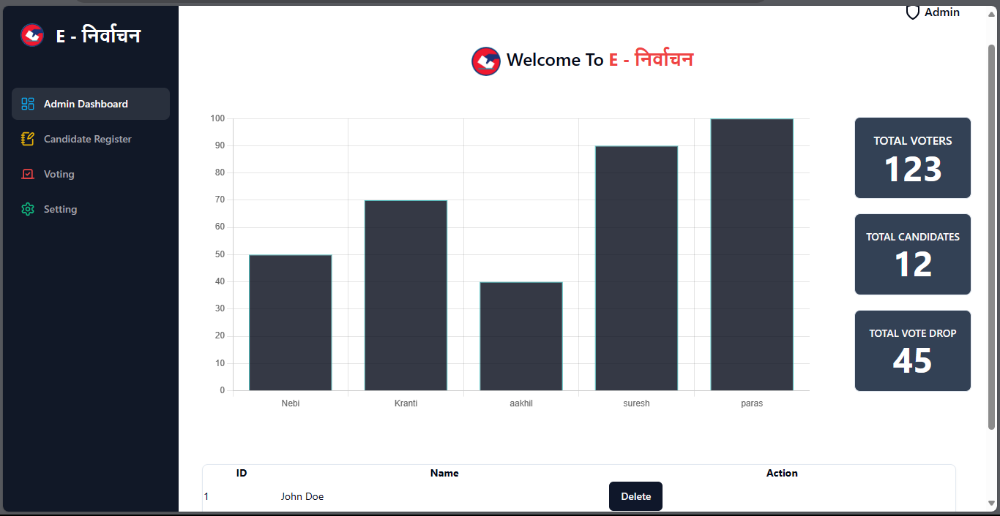
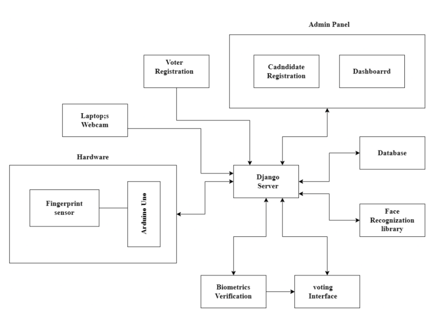

# E-निर्वाचन 
## Introduction
* Nepal's current voting system is paper-based and has remained largely unchanged
since 1959.
* The manual process of paper-based voting is time-consuming, prone to
manipulation, and involves significant human labor.
* The lack of a digital voting system leaves room for rigging, vandalism of voting
booths, alteration of vote counting, and manipulation during transportation.
* The use of traditional ballot paper-based voting is outdated, inefficient, and costly
in terms of time, money, and manpower.
* The proposed digital voting system using biometrics aims to address these
challenges by introducing a user-friendly and efficient method for elections,
particularly in rural areas.

## Problem Statement
* The traditional ballot paper-based voting system in Nepal is inefficient, timeconsuming, and prone to human errors.
* Voting booths can be compromised through bribery or other means, compromising
the integrity of the election.
* Transportation and counting of votes can be tampered with, leading to potential
manipulation of the election results.
## Objectives
* To develop a voting system with two factor authentication using biometrics
recognition.
* To develop a server system which will efficiently integrate all the components and
have functionality of voter and candidate registration.

## Methodology
1. System Block Diagram

2. Fingerprint recognition pipeline
    -  Fingerprint Enrollment
    
    - Fingerprint Matching
    
    - Face recognition pipeline
    
3. Voting Process
    * After user is verified they will cast votes in the voting machine.
    * For this project votes will be entered through buttons available in the system.
    * The voting count will be update for different candidates.
    * Flags will be update in voter’s database to check whether they have voted for
    particular candidate or not.

    

* Django Server Backbone: Controls data flow, ensures integrity, and implements security measures.
* Django REST Framework: Enables seamless front-end and back-end communication via RESTful
APIs.
* Token-Based Authentication: Uses JWT for secure user authentication and access control.
* JSON Data Formatting: Organizes biometric data efficiently and ensures compatibility across
platforms.
* Security Measures: Implements CORS to control backend resource access and mitigate security
risks.
* Session and Token Management: Manages user sessions and token expiration for secure access.
* Efficient Data Exchange: Utilizes JSON for fast and secure communication between server and
client.
* Reliability and Scalability: Integrates Django tools for reliable and scalable system operation.

## Epilogue
 ### Output:
* The project delivers a digital voting system with two-factor authentication (facial and fingerprint
*ecognition).
* Users register biometric data, while the admin registers candidates.
* During voting, users authenticate via biometrics before casting their votes.
* Admin can publish overall vote count for each candidate.
### Discussion:
* Originally planned as a fully equipped voting box, budget constraints led to software-focused
adjustments.
* Components like ESP32 Camera were replaced with laptop webcams, and physical buttons with a
web application interface.
* Despite last-minute changes, core functionality remained intact, achieving project goals.
### Future Enhancements:
* The system allows for future enhancements, including full conversion to a software-based voting
system accessible from any device.
* Integration of blockchain technology can enhance security and credibility.
* Dual-factor authentication can be adjusted based on availability, offering flexibility in
authentication methods.
* Options for physical voting box implementation cater to rural areas with limited internet access.
### Conclusion:
* The implemented digital voting system advances voting security through two-factor authentication.
* It aims to democratize voting by considering remote voting options and enhancing accessibility.
* Despite initial challenges, the system achieves its core objectives and presents opportunities for
further improvement and modernization in Nepal's electoral procedures.

## Appendix

